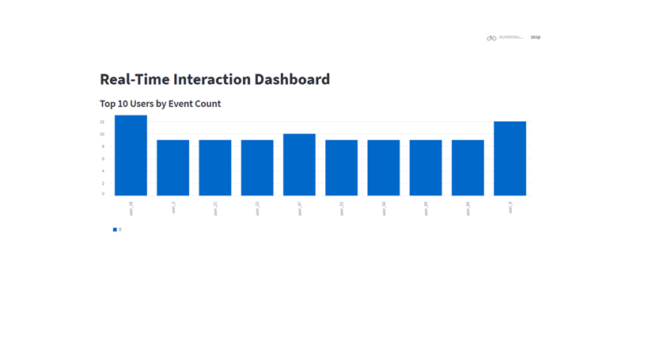
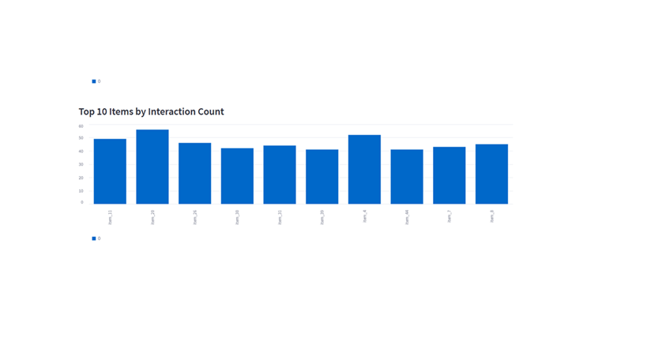
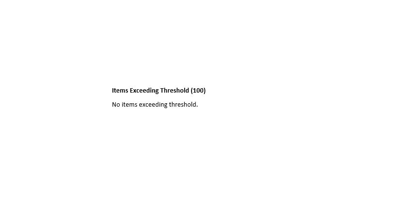

# 📊 End-to-End Real-Time Data Pipeline with Kafka for User Interaction Analytics

## 📌 Overview
This project implements a **real-time data pipeline** that simulates user interaction events, processes them using a streaming architecture, and visualizes live metrics via a dashboard.

It demonstrates **production-level data engineering practices**, including event streaming, stateful aggregation, alerting, and containerized deployment.

---

## 🏗️ Architecture


Producer → Kafka → Aggregator → JSON Store → Streamlit Dashboard


### Components
- **Producer (`producer.py`)**: Simulates user events (`click`, `view`, `purchase`) and publishes them to Kafka.  
- **Kafka**: Distributed event streaming platform that decouples producers and consumers.  
- **Aggregator (`aggregator.py`)**: Consumes Kafka events, aggregates data by user/item, writes results to `aggregated_data.json`, and triggers threshold-based alerts.  
- **Dashboard (`dashboard.py`)**: Live visualization of aggregated metrics using Streamlit.  

---

## ⚙️ Tech Stack
- **Streaming**: Apache Kafka  
- **Processing**: Python  
- **Visualization**: Streamlit  
- **Infrastructure**: Docker & Docker Compose  
- **Storage**: JSON (lightweight)  

---

## 🚀 Features
- Real-time ingestion of user interaction events  
- Continuous aggregation per user/item  
- Threshold-based alerting system  
- Live dashboard displaying:
  - Top users and items
  - Event type distribution
  - Real-time alerts  
- Dockerized setup for quick deployment  

---

## 📊 Data Flow
1. `producer.py` generates simulated events.  
2. Events are published to Kafka topic `user_interactions`.  
3. `aggregator.py` consumes events and:
   - Maintains in-memory aggregations  
   - Writes results to `aggregated_data.json`  
   - Triggers alerts if thresholds are exceeded  
4. `dashboard.py` reads the aggregated data and updates visuals in real time.  

---

## 🛠️ Setup Instructions

### Prerequisites
- Python 3.10+  
- Docker Desktop  

### 1. Install Dependencies

```bash
pip install -r requirements.txt
2. Start Kafka & Zookeeper
docker-compose up -d
docker ps

Verify services:

Kafka → localhost:9092
Zookeeper → localhost:2181
3. Run the Pipeline

Terminal 1 – Producer

python producer.py

Terminal 2 – Aggregator

python aggregator.py

Terminal 3 – Dashboard

streamlit run dashboard.py

Open dashboard: http://localhost:8501

📸 Streamlit Dashboard Demo

Here are snapshots of the live dashboard:

<p float="left">    </p>
📈 Metrics & Insights
Interactions per user
Interactions per item
Event type distribution
Real-time threshold alerts
⚠️ Alerting
Configurable threshold in aggregator.py
Alerts triggered when user/item activity exceeds threshold
Logged in real-time in aggregator console
🧠 Design Considerations

Scalability

Kafka partitions allow horizontal scaling
Multiple consumers can process in parallel

Fault Tolerance

Kafka retains messages for replay
Can be extended with checkpointing

Extensibility

Replace JSON with:
Redis
PostgreSQL
Data warehouse
🔮 Future Improvements
Windowed aggregations
Kafka Streams / Faust
Persistent state (Redis / RocksDB)
REST API
Kubernetes deployment
Monitoring (Prometheus + Grafana)
📚 Skills Demonstrated
Real-time data streaming
Event-driven architecture
Kafka producer/consumer
Stateful aggregation
Docker deployment
🤝 Acknowledgement

Some parts of the implementation were developed with AI assistance.
All testing and validation were done independently.
